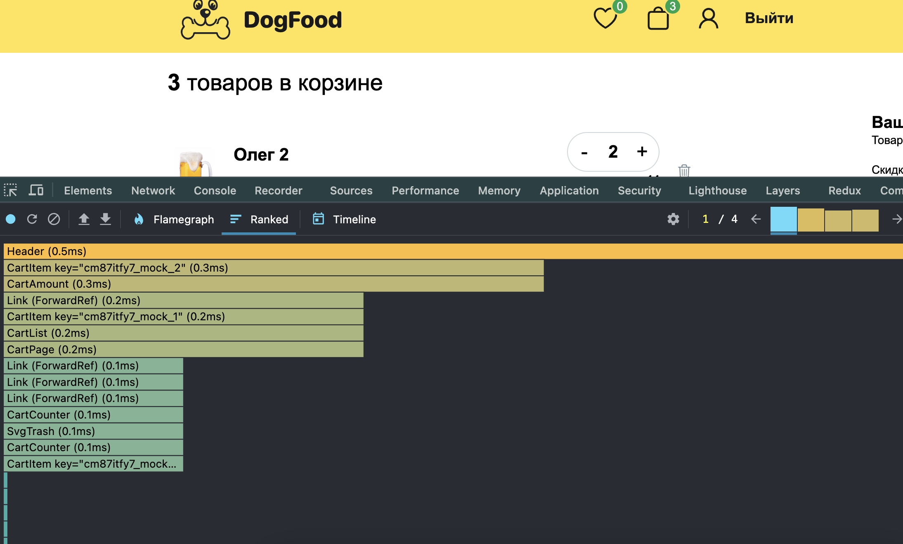
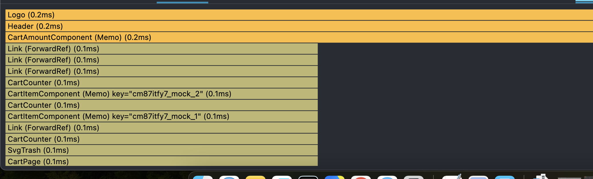

# REACT_PRO_final_project_base — Final Project

## Что было сделано по задачам

### 1) Архитектура и структура

- Вынесены слой Апп хок и WithProtection / router /
- Инициализация хранилища
- Разделение фичей получилось следующее auth / products / cart - взаимодействие со стором и пользовательское действие
- Добавлена страница. Products page
- Внесены не достающие стили для отображения корректного ui
- Добавлены / расширены некоторые страницы для удобства чтения и хранение компонентов которые используются только в этой странице
- Из Shared убраны компонентам с логикой  Sort/Search/LoadMore
- Внесена единообразная структуризация для папок индекс  -> папка -> компонент стили компонента (есл присутствуют)

### 2) Оптимизация

 - pages/CartPage/ui/CartList.tsx → React.memo + useMemo для списка
 - pages/CartPage/ui/CartItem.tsx → React.memo + useCallback для удаления
 - pages/CartPage/ui/CartAmount.tsx → React.memo + useMemo для total/discount + useCallback для обработчиков

## React DevTools Profiler analysis

```text
docs/profiler/
```

### Screenshots before and after

#### Cart page
1. 
2. 

### 3) React.Portal (модалка)
- Открывается модалка при нажатии на кнопку Оформить заказ

### 4) useRef (реальное применение)
- SignIn form autofocus при загрузке на емейл

###  5) Альтернативная сборка (Vite + SWC)
- Добавлена Vite сборка на `@vitejs/plugin-react-swc`:
  - `vite.config.ts`
- Скрипты:
  - `npm run dev:vite`
  - `npm run build:vite` (вывод: `dist-vite/`)
  - `npm run compare:builds` (сравнение времени/размера: webpack vs vite)

### Сравнение сборок (заполнить после запуска)
Запустите:
```bash
npm run compare:builds
```

- Webpack: 13868ms, dist size: 0.98 MB
- Vite(SWC): 3858ms, dist-vite size: 0.95 MB

---
## 6) React 19 hooks (useActionState / useOptimistic)

### useOptimistic — «лайк» товара
- `features/products/ui/LikeButton` использует `useOptimistic`:
  - UI переключает «лайк» сразу, без ожидания ответа
  - при ошибке — откат
